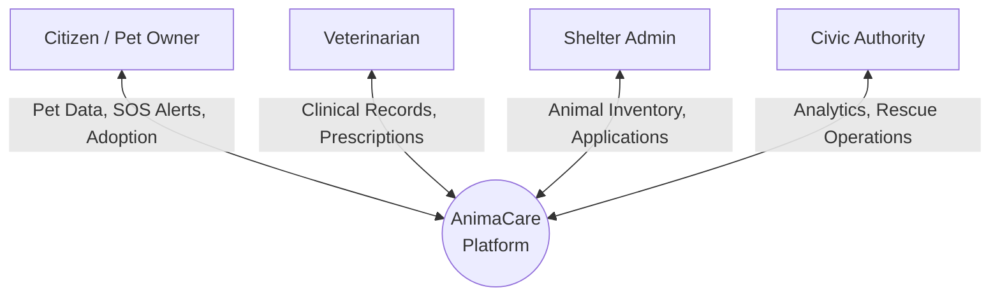
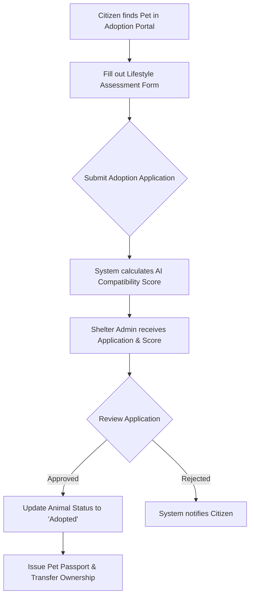

# AnimaCare Project Documentation

This document covers the core design components of the **AnimaCare** platform. It includes the System Design Architecture, Data Flow Diagrams (DFD), core Application Algorithms, and the Database Table Design.

---

## 1. System Design & Architecture

AnimaCare follows a modern decoupled **Client-Server Architecture**, adhering to the MVC (Model-View-Controller) / MVT (Model-View-Template) pattern on the backend and an SPA (Single Page Application) pattern on the frontend.

### Tech Stack
*   **Frontend**: React.js (Vite), CSS/TailwindCSS for styling.
*   **Backend**: Django (Python), Django REST Framework for API endpoints.
*   **Database**: PostgreSQL (AWS RDS) / SQLite (Local dev).
*   **Storage**: AWS S3 for media (Diagnostic media, Pet images).

### Module Architecture
The system is divided into role-based modules ensuring strict separation of concerns and Access Control (RBAC):
1.  **Citizens (Pet Owners)**: Register pets, book appointments, adopt, and trigger SOS alerts.
2.  **Veterinarians**: Access clinical records, log consultations, generate digital prescriptions.
3.  **Shelter Administrators**: Manage animal inventory, process adoption applications.
4.  **Civic Authorities**: View public health analytics, manage rescue operations.
5.  **Super Admin / Governance**: Manage system health, RBAC, and view audit trails.

---

## 2. Data Flow Diagrams (DFD) & Flow Charts

### Level 0 Context DFD
The context diagram shows the entire AnimaCare system as a single process interacting with external entities (Users).



### Flow Chart: Animal Adoption Workflow
The following flow chart describes the algorithm and workflow of adopting an animal via the platform.



---

## 3. Algorithms

### A. Adoption Compatibility Matching Algorithm
This algorithm calculates the `AICompatibilityScore` to assist Shelter Administrators in deciding if an adopter is a good match for a specific animal.

**Inputs:**
*   `User_Lifestyle`: Housing type, activity level, other pets, working hours.
*   `Animal_Traits`: Energy level, space requirement, sociability, medical needs.

**Pseudocode:**
```text
FUNCTION calculate_compatibility(User_Lifestyle, Animal_Traits):
    score = 0
    max_score = 100

    // Check Space Compatibility
    IF Animal_Traits.space_req <= User_Lifestyle.housing_type:
        score += 25
    ELSE:
        score += 10
    
    // Check Activity Level MATCH
    diff = ABS(Animal_Traits.energy_level - User_Lifestyle.activity_level)
    IF diff == 0:
        score += 30
    ELSE IF diff == 1:
        score += 15
    
    // Check Household Compatibility
    IF Animal_Traits.needs_solo AND User_Lifestyle.has_other_pets:
        score -= 20
    ELSE:
        score += 25

    // Check Time Availability
    IF User_Lifestyle.working_hours < 8 OR Animal_Traits.is_independent:
        score += 20

    RETURN score / max_score * 100  // Return percentage
```

---

## 4. Table Design (Database Schema)

Here are the primary tables designed for the database using the Django ORM.

### User Roles & Profiles Tables
| Table Name | Fields | Relationships | Description |
| :--- | :--- | :--- | :--- |
| `User` | ID (PK), email, password, is_active, role | None | Extended base user model handling authentication. |
| `VeterinarianProfile` | ID (PK), user_id (FK), license_number, clinic_name | Belongs to User | Vet specifics. |
| `ShelterAdminProfile` | ID (PK), user_id (FK), shelter_id (FK) | Belongs to User, Shelter | Shelter admin specifics. |
| `CivicAuthorityProfile` | ID (PK), user_id (FK), department | Belongs to User | Authority specifics. |

### Citizen & Pet Registration Tables
| Table Name | Fields | Relationships | Description |
| :--- | :--- | :--- | :--- |
| `Pet` | ID (PK), owner_id (FK), name, species, breed, age, status | Belongs to User | Data about an owned pet. |
| `SOSAlert` | ID (PK), reporter_id (FK), lat, lng, description, status | Belongs to User | Missing or injured animal alerts. |

### Clinical & Health Tables
| Table Name | Fields | Relationships | Description |
| :--- | :--- | :--- | :--- |
| `ConsultationLog` | ID (PK), pet_id (FK), vet_id (FK), notes, datetime | Belongs to Pet, Vet | Vitals and notes. |
| `VaccinationLog` | ID (PK), pet_id (FK), vaccine_name, date_administered | Belongs to Pet | Immutable vaccination history. |
| `DigitalPrescription` | ID (PK), log_id (FK), medication, dosage | Belongs to ConsultationLog | Medicines prescribed. |

### Shelter & Adoption Tables
| Table Name | Fields | Relationships | Description |
| :--- | :--- | :--- | :--- |
| `Shelter` | ID (PK), name, location, capacity | None | Registered shelters. |
| `AnimalInventory` | ID (PK), shelter_id (FK), species, breed, health_status | Belongs to Shelter | Animals pending adoption. |
| `AdoptionApplication`| ID (PK), animal_id (FK), applicant_id (FK), status, ai_score| Belongs to AnimalInventory, User | Citizen applications. |
| `LifestyleAssessment`| ID (PK), user_id (FK), housing_type, activity_level | Belongs to User | Data for AI compatibility. |

### System Governance Table
| Table Name | Fields | Relationships | Description |
| :--- | :--- | :--- | :--- |
| `AuditTrail` | ID (PK), user_id (FK), action, timestamp, ip_address | Belongs to User | Logs all critical secure interactions. |


AnimaCare Project Documentation
This document covers the core design components of the AnimaCare platform. It includes the System Design Architecture, Data Flow Diagrams (DFD), core Application Algorithms, and the Database Table Design.

1. System Design & Architecture
AnimaCare follows a modern decoupled Client-Server Architecture, adhering to the MVC (Model-View-Controller) / MVT (Model-View-Template) pattern on the backend and an SPA (Single Page Application) pattern on the frontend.
Tech Stack
* Frontend: React.js (Vite), CSS/TailwindCSS for styling.
* Backend: Django (Python), Django REST Framework for API endpoints.
* Database: PostgreSQL (AWS RDS) / SQLite (Local dev).
* Storage: AWS S3 for media (Diagnostic media, Pet images).
Module Architecture
The system is divided into role-based modules ensuring strict separation of concerns and Access Control (RBAC):
1. Citizens (Pet Owners): Register pets, book appointments, adopt, and trigger SOS alerts.
2. Veterinarians: Access clinical records, log consultations, generate digital prescriptions.
3. Shelter Administrators: Manage animal inventory, process adoption applications.
4. Civic Authorities: View public health analytics, manage rescue operations.
5. Super Admin / Governance: Manage system health, RBAC, and view audit trails.

2. Data Flow Diagrams (DFD) & Flow Charts
Level 0 Context DFD
The context diagram shows the entire AnimaCare system as a single process interacting with external entities (Users).
Pet Data, SOS Alerts, AdoptionClinical Records, PrescriptionsAnimal Inventory, ApplicationsAnalytics, Rescue OperationsCitizen / Pet OwnerVeterinarianShelter AdminCivic AuthorityAnimaCare\nPlatform
Flow Chart: Animal Adoption Workflow
The following flow chart describes the algorithm and workflow of adopting an animal via the platform.
ApprovedRejectedCitizen finds Pet in Adoption PortalFill out Lifestyle Assessment FormSubmit Adoption ApplicationSystem calculates AI Compatibility ScoreShelter Admin receives Application & ScoreReview ApplicationUpdate Animal Status to 'Adopted'System notifies CitizenIssue Pet Passport & Transfer Ownership

3. Algorithms
A. Adoption Compatibility Matching Algorithm
This algorithm calculates the AICompatibilityScore to assist Shelter Administrators in deciding if an adopter is a good match for a specific animal.
Inputs:
* User_Lifestyle: Housing type, activity level, other pets, working hours.
* Animal_Traits: Energy level, space requirement, sociability, medical needs.
Pseudocode:
text
FUNCTION calculate_compatibility(User_Lifestyle, Animal_Traits):
    score = 0
    max_score = 100
    // Check Space Compatibility
    IF Animal_Traits.space_req <= User_Lifestyle.housing_type:
        score += 25
    ELSE:
        score += 10
    
    // Check Activity Level MATCH
    diff = ABS(Animal_Traits.energy_level - User_Lifestyle.activity_level)
    IF diff == 0:
        score += 30
    ELSE IF diff == 1:
        score += 15
    
    // Check Household Compatibility
    IF Animal_Traits.needs_solo AND User_Lifestyle.has_other_pets:
        score -= 20
    ELSE:
        score += 25
    // Check Time Availability
    IF User_Lifestyle.working_hours < 8 OR Animal_Traits.is_independent:
        score += 20
    RETURN score / max_score * 100  // Return percentage

4. Table Design (Database Schema)
Here are the primary tables designed for the database using the Django ORM.
User Roles & Profiles Tables
Table Name
Fields
Relationships
Description
User
ID (PK), email, password, is_active, role
None
Extended base user model handling authentication.
VeterinarianProfile
ID (PK), user_id (FK), license_number, clinic_name
Belongs to User
Vet specifics.
ShelterAdminProfile
ID (PK), user_id (FK), shelter_id (FK)
Belongs to User, Shelter
Shelter admin specifics.
CivicAuthorityProfile
ID (PK), user_id (FK), department
Belongs to User
Authority specifics.
Citizen & Pet Registration Tables
Table Name
Fields
Relationships
Description
Pet
ID (PK), owner_id (FK), name, species, breed, age, status
Belongs to User
Data about an owned pet.
SOSAlert
ID (PK), reporter_id (FK), lat, lng, description, status
Belongs to User
Missing or injured animal alerts.
Clinical & Health Tables
Table Name
Fields
Relationships
Description
ConsultationLog
ID (PK), pet_id (FK), vet_id (FK), notes, datetime
Belongs to Pet, Vet
Vitals and notes.
VaccinationLog
ID (PK), pet_id (FK), vaccine_name, date_administered
Belongs to Pet
Immutable vaccination history.
DigitalPrescription
ID (PK), log_id (FK), medication, dosage
Belongs to ConsultationLog
Medicines prescribed.
Shelter & Adoption Tables
Table Name
Fields
Relationships
Description
Shelter
ID (PK), name, location, capacity
None
Registered shelters.
AnimalInventory
ID (PK), shelter_id (FK), species, breed, health_status
Belongs to Shelter
Animals pending adoption.
AdoptionApplication
ID (PK), animal_id (FK), applicant_id (FK), status, ai_score
Belongs to AnimalInventory, User
Citizen applications.
LifestyleAssessment
ID (PK), user_id (FK), housing_type, activity_level
Belongs to User
Data for AI compatibility.
System Governance Table
Table Name
Fields
Relationships
Description
AuditTrail
ID (PK), user_id (FK), action, timestamp, ip_address
Belongs to User
Logs all critical secure interactions.
